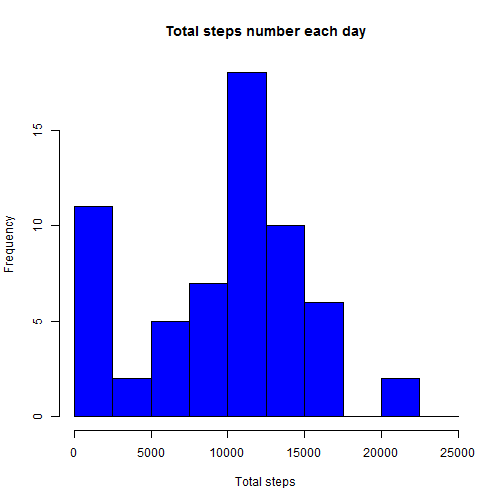
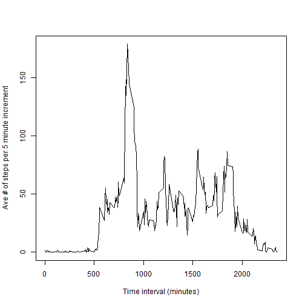
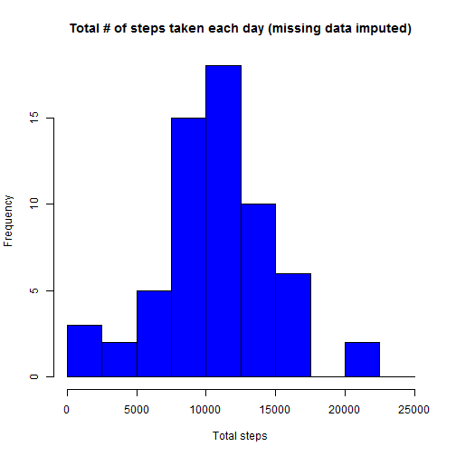
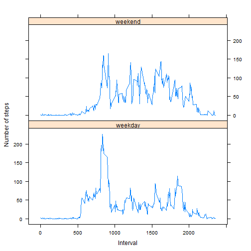

## Loading and preprocessing the data
Load the data by unzipping the file and read the csv file.

```r
unzip("activity.zip")
activity<-read.csv("activity.csv", colClasses=c("numeric","Date","numeric"), na.strings="NA")
```
## What is mean total number of steps taken per day?    

Calculate the total number of steps per day.


```r
totalsteps <- tapply(activity$steps, activity$date, sum,na.rm=TRUE)
```

Histogram of total steps on each day in the two months.


```r
break_seq<-seq(from=0, to=25000, by=2500)
hist(totalsteps,breaks=break_seq, col="blue",main="Total steps number each day",xlab="Total steps")
```

 


```r
cat("The mean of steps taken per day is", mean(totalsteps),"and the median is",median(totalsteps))
```

```
## The mean of steps taken per day is 9354.23 and the median is 10395
```

## What is the average daily activity pattern?

Calculate the number of steps for each 5 minute increment.


```r
interval_sum<-with(activity, aggregate(steps, list(interval),sum,na.rm=TRUE))
colnames(interval_sum)<-c("interval","steps")
```

Now data can be used to plot the average number of steps vs time in 5 min increment.


```r
interval_ave<-interval_sum$steps/61
plot(interval_sum$interval, interval_ave ,type="l", xlab="Time interval (minutes)", ylab="Ave # of steps per 5 minute increment")
```

 

Find the 5 minute increment with the maximum number of steps.

```r
max_steps<-max(interval_sum$steps)
max_steps_location<-interval_sum$steps==max_steps
max_interval<-interval_sum$interval[max_steps_location]
cat("The 5-minute increment with the maximum number of steps is", max_interval)
```

```
## The 5-minute increment with the maximum number of steps is 835
```

## Imputing missing values

Before imputing missing values, the number of missing values was calculated.


```r
na_vector<-is.na(activity$steps)
sum_na<-sum(na_vector)

cat("The total number of missing values in the data set is", sum_na)
```

```
## The total number of missing values in the data set is 2304
```

Imputation strategy used was to impute the mean for each 5-minute interval in place of the missing values. 

```r
# imputed values added and combined into a new data frame
each_interval<-rep(interval_ave,61)
steps_impute<-each_interval[na_vector]
date_impute<-activity$date[na_vector]
interval_impute<-activity$interval[na_vector]
activity_impute<-data.frame(steps_impute,date_impute,interval_impute)
colnames(activity_impute)<-c("steps","date","interval")

# na values dropped from old data frame
activity<-activity[!na_vector,]

# two data frames combined to form one new data frame that includes imputed data
activity_impute<-rbind(activity,activity_impute)

# now reorder the data frame by date and interval
df_order<-order(activity_impute$date,activity_impute$interval)
activity_impute<-activity_impute[df_order,]
```

The same strategy as above was used to get the total number of steps for each day with the imputed data.


```r
step_sum_imp<-with(activity_impute, tapply(steps, date, sum))
```

The following histogram includes the imputed data. Note that this histogram's central mode is more pronounced since some of the data near zero in the first histogram has been shifted.

```r
hist(step_sum_imp,breaks=break_seq,col="blue",main="Total # of steps taken each day (missing data imputed)",xlab="Total steps")
```

 


```r
cat("With missing data imputed, mean total number of steps taken per day is", mean(step_sum_imp),"and the median is",median(step_sum_imp))
```

```
## With missing data imputed, mean total number of steps taken per day is 10581.01 and the median is 10395
```


## Are there differences in activity patterns between weekdays and weekends?

Examine the question of whether there is a difference between the individual's activity patterns on the weekend and on weekdays. First, we'll use the imputed data and categorize each day by weekend or weekday.


```r
# pull in the day of the week for each date
wd<-weekdays(activity_impute$date)
wd<-factor(wd)
activity_impute<-cbind(activity_impute,wd)

# check to see if each day is a weekday
weekday<-c("Monday","Tuesday","Wednesday","Thursday","Friday")
weekday_truth<-wd %in% weekday

# wd_imputed is the weekdays. we_imputed is the weekends.
wd_imputed<-activity_impute[weekday_truth,]
we_imputed<-activity_impute[!weekday_truth,]
```

Now create the 5-minute interval averages for each group.


```r
interval_ave_wd<-with(wd_imputed, aggregate(steps, list(interval),mean))
colnames(interval_ave_wd)<-c("interval","steps")

interval_ave_we<-with(we_imputed, aggregate(steps, list(interval),mean))
colnames(interval_ave_we)<-c("interval","steps")
```

Here is the resulting plot broken out by factors of weekday and weekend, using the lattice plot package, as per project requirements. There are differences in the two plots. The weekday plot seems to follow a more clearly defined set of patterns, possibly due to weekday routines. There's also a noticable spike in activity near the beginning of the day on weekdays. Weekdays, also feature fewer steps overall, perhaps due to work or school requirements.


```r
# Create a new data frame, ave_all, where "day" is a factor variable that refers to weekday or weekend for use by lattice plot package.
day<-factor(rep("weekday",length(interval_ave_wd$steps)))
interval_ave_wd<-data.frame(interval_ave_wd,day)


day<-factor(rep("weekend",length(interval_ave_we$steps)))
interval_ave_we<-data.frame(interval_ave_we,day)

ave_all<-data.frame(rbind(interval_ave_wd,interval_ave_we))

library(lattice)
xyplot(steps ~ interval | day, data=ave_all,type="l", xlab="Interval", ylab="Number of steps", layout=c(1,2))
```

 
